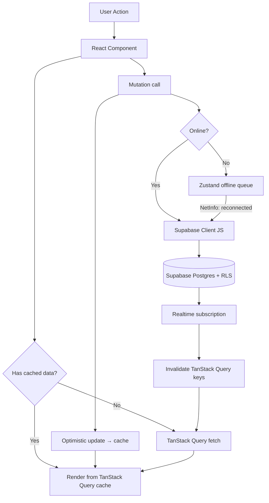

# Splitkar! — Architecture

## Tech Stack

| Layer                 | Choice                          | Reason                                                      |
| --------------------- | ------------------------------- | ----------------------------------------------------------- |
| Mobile framework      | Expo SDK 55 + React Native      | Cross-platform iOS + Android from one codebase              |
| Routing               | Expo Router (file-based)        | Type-safe navigation, deep-link handling built-in           |
| Backend               | Supabase                        | Postgres + Auth + Realtime + Storage in one managed service |
| Server state          | TanStack Query v5               | Caching, background refresh, optimistic updates             |
| Client state          | Zustand                         | Minimal boilerplate, no context hell                        |
| Styling               | NativeWind v4 (Tailwind for RN) | Utility-first; works on all platforms                       |
| UI components         | gluestack-ui v2                 | Headless, NativeWind-native; zero style-system conflict     |
| Forms                 | react-hook-form + zod           | Schema-first validation, minimal re-renders                 |
| Push notifications    | Expo Notifications              | Single API for iOS + Android                                |
| Crash + Analytics     | Sentry + PostHog                | Error tracking + product analytics                          |
| Subscriptions (later) | RevenueCat                      |                                                             |
| Ads (later)           | react-native-google-mobile-ads  |                                                             |

**Component library rationale:** gluestack-ui v2 is built as NativeWind's companion.
Components ship unstyled and accept `className` props directly, so there is no
competing style engine. Tamagui's build-time compiler would create friction alongside
NativeWind and bloat the bundle with a parallel theming system.

---

## Folder Structure

```
splitkar/
├── app/                          # Expo Router pages (file = route)
│   ├── _layout.tsx               # Root layout — auth guard, providers
│   ├── +not-found.tsx
│   ├── (auth)/                   # Unauthenticated stack
│   │   ├── _layout.tsx
│   │   ├── index.tsx             # Phone number entry
│   │   └── verify.tsx            # OTP verification
│   └── (app)/                    # Authenticated tab root
│       ├── _layout.tsx           # Bottom tab navigator
│       ├── groups/
│       │   ├── index.tsx         # Group list
│       │   ├── new.tsx           # Create group
│       │   └── [id]/
│       │       ├── index.tsx     # Group detail + expenses
│       │       ├── balances.tsx  # Per-group balances
│       │       ├── activity.tsx  # Activity feed
│       │       └── settle.tsx    # Settle-up screen
│       ├── activity/
│       │   └── index.tsx         # Global activity feed
│       └── profile/
│           └── index.tsx         # User profile + settings
│
├── features/                     # Business logic, co-located by domain
│   ├── auth/
│   │   ├── components/           # PhoneForm, OtpForm
│   │   ├── hooks/                # useAuth, useSession
│   │   └── store.ts              # Zustand auth slice
│   ├── groups/
│   │   ├── components/           # GroupCard, GroupAvatar, InviteQR
│   │   ├── hooks/                # useGroups, useGroup, useJoinGroup
│   │   └── api.ts                # TanStack Query defs
│   ├── expenses/
│   │   ├── components/           # ExpenseForm, SplitEditor, ExpenseCard
│   │   ├── hooks/                # useExpenses, useAddExpense
│   │   └── api.ts
│   ├── balances/
│   │   ├── components/           # BalanceCard, DebtArrow
│   │   └── hooks/                # useBalances, useSimplifiedDebts
│   └── settlements/
│       ├── components/           # SettleForm, UpiButton
│       └── hooks/                # useSettleUp
│
├── components/                   # Shared, domain-agnostic UI
│   ├── ui/                       # Button, Input, Avatar, Badge, Sheet
│   └── layout/                   # SafeView, ScreenHeader, FAB
│
├── lib/
│   ├── supabase.ts               # Supabase client + type-safe helpers
│   ├── queryClient.ts            # TanStack QueryClient configuration
│   └── notifications.ts          # Expo Notifications setup
│
├── store/
│   └── index.ts                  # Root Zustand store (compose slices)
│
├── utils/
│   ├── money.ts                  # Paise ↔ display (formatINR, toPaise)
│   ├── debt.ts                   # simplifyDebts() — see debt-simplification.md
│   └── upi.ts                    # buildUpiLink(pa, pn, am, tn, tr, cu)
│
├── types/
│   └── database.ts               # Generated Supabase types (npx supabase gen types)
│
├── constants/
│   ├── theme.ts                  # Brand colours, spacing tokens
│   └── currencies.ts             # Supported currency metadata
│
├── docs/                         # Design docs (this file lives here)
│
├── .github/
│   ├── workflows/ci.yml
│   └── pull_request_template.md
│
├── .env                          # Local secrets — NEVER committed
├── .env.example                  # Placeholder template — committed
├── app.json                      # Expo config
├── eas.json                      # EAS Build config
├── babel.config.js
├── metro.config.js
├── tailwind.config.js
├── global.css
├── tsconfig.json
└── README.md
```

---

## Data Flow



---

## Offline Sync Strategy

### Design Goals

1. **Immediate UI feedback** — mutations feel instant on any connection.
2. **No data loss** — queued mutations survive app restarts (Zustand persisted to
   `expo-secure-store` via `zustand/middleware/persist`).
3. **Conflict-free where possible** — expense and settlement IDs are UUIDs generated
   client-side before the insert, making mutations idempotent.

### Layers

| Layer              | Mechanism                                                                                                   |
| ------------------ | ----------------------------------------------------------------------------------------------------------- |
| Optimistic updates | TanStack Query `onMutate` pre-updates the cache; `onError` rolls back                                       |
| Network detection  | `@react-native-community/netinfo` — subscribe to connection events                                          |
| Offline queue      | Zustand slice `offlineQueue: Mutation[]` persisted to SecureStore                                           |
| Queue drain        | On reconnect event, drain queue in FIFO order; failed items retry with exponential back-off (max 3 retries) |
| Server authority   | After queue drains, invalidate all affected query keys to re-fetch ground truth                             |

### Conflict Strategy (Phase 1)

- **Expenses / Settlements:** append-only writes; no two clients update the same row
  at the same time. Last-writer-wins on expense edits (the `updated_at` column acts
  as an audit trail).
- **User profiles:** last-write-wins; conflicts are rare (single-device per user
  in Phase 1).
- **Groups:** admin operations are single-user; no concurrent admin conflicts expected.

---

## Deep Linking

### Phase 1 (Development)

Expo dev scheme: `splitkar://`

| Route                     | URL                             |
| ------------------------- | ------------------------------- |
| Join group by invite code | `splitkar://join?code=ABCD1234` |
| View group                | `splitkar://groups/[id]`        |

### Phase 2+ (Production — plug-in points)

When a domain is purchased and bundle ID is finalised:

- **iOS Universal Links:** add an `apple-app-site-association` (AASA) file at
  `https://splitkar.app/.well-known/apple-app-site-association` and enable
  `com.apple.developer.associated-domains` entitlement in `app.json`.
- **Android App Links:** add Digital Asset Links JSON at
  `https://splitkar.app/.well-known/assetlinks.json` and declare `android.intent.action.VIEW`
  intent filters.
- In `app.json`, update `intentFilters` (Android) and `associatedDomains` (iOS).
- Current placeholder scheme `splitkar://` remains as a fallback for direct
  installs from TestFlight / internal distribution.

---

## Environment Variables

See `.env.example` for the full list. Quick summary:

| Variable                        | Client-safe?                 | Purpose                      |
| ------------------------------- | ---------------------------- | ---------------------------- |
| `EXPO_PUBLIC_SUPABASE_URL`      | ✅ Yes                       | Supabase project URL         |
| `EXPO_PUBLIC_SUPABASE_ANON_KEY` | ✅ Yes                       | Public (publishable) API key |
| `SUPABASE_SERVICE_ROLE_KEY`     | ❌ No — server / CI only     | Bypasses RLS                 |
| `SUPABASE_DB_PASSWORD`          | ❌ No — local DB access only | Direct Postgres connection   |
| `SUPABASE_ACCESS_TOKEN`         | ❌ No — CI / CLI only        | Supabase management API      |
| `EXPO_PUBLIC_SENTRY_DSN`        | ✅ Yes                       | Sentry error reporting       |
| `EXPO_PUBLIC_POSTHOG_API_KEY`   | ✅ Yes                       | PostHog analytics            |

`EXPO_PUBLIC_*` variables are embedded in the JavaScript bundle at build time.
**Never** prefix a secret with `EXPO_PUBLIC_`.
